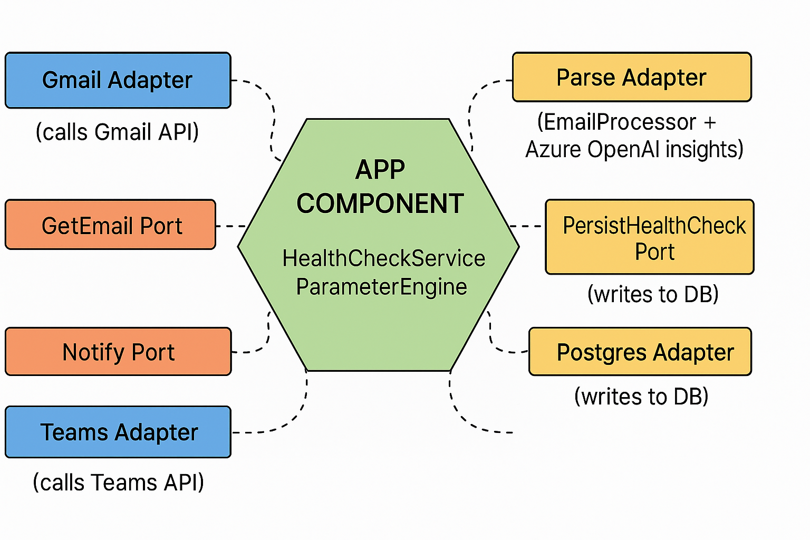

# Agent HealthCheck – Azure AI Agent for Email-based Monitoring

## Overview
Agent HealthCheck is an Azure-based automation agent that streamlines SQL Server monitoring.
On a schedule, it scans a Gmail inbox for daily health-check emails (and PDFs), extracts key insights with Azure OpenAI, applies rule-based severity, and posts a concise summary to Microsoft Teams.

This repository demonstrates an event-driven, production-oriented pattern on Azure Functions with clean separation of concerns, CI/CD via GitHub Actions, and secure secret management.

---

## Architecture

## Hexagonal Architecture

### Features

- Timer-triggered Azure Function polls the Gmail inbox on a cron schedule.
- Gmail API integration using a service account with delegated user access.
- Robust parsing of plain-text/HTML bodies and PDF attachments.
- AI summarization (Azure OpenAI) transforms free-form reports into a structured schema.
- Rules engine evaluates severity (e.g., disk capacity, failed jobs, backup gaps).
- Pluggable notifications designed for Microsoft Teams (webhook or Graph).

### Project Status

- Modular repository structure (src/, tests/, function_app.py).
- Gmail auth via service account + delegated user.
- EmailProcessor for search, fetch, decode, and LLM prompt.
- ParameterEngine for rule-based evaluation.
- Local execution tested; logs verified.
- Teams outbound integration wired and documented.
- CI/CD (GitHub Actions → Azure Functions App) enabled for main.
- Production deployment and runbook.

## End Goal Checklist
### Core Functionality
Poll Gmail on schedule, filter by subject/time window.

Extract and normalize email/PDF health-check content.

Summarize into a consistent JSON schema.

Evaluate and tag severity with deterministic rules.

Integration & Automation

Post summaries to a Teams channel (success + alert paths).

GitHub Actions build/test/deploy on push to main.

Service principal auth for Azure; no interactive flows.

Production Readiness

Application Insights telemetry and custom logs.

Error handling, retries, and dead-letter strategy.

Runbook: configuration, secrets rotation, on-call actions.

Branch strategy, unit tests, and code-owners for reviews.
